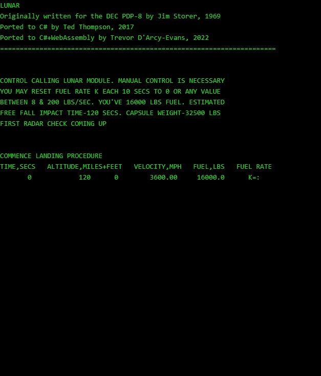

# WebConsole
Porting console apps to the web made easy.



## Background
Largely based on a web compatible 
[console layer](https://github.com/ZacharyPatten/dotnet-console-games/blob/6cb5187bcdca5b3c53d036ca7cf7673848830514/Projects/Website/BlazorConsole.cs)
used to port [DOS console games](https://github.com/ZacharyPatten/dotnet-console-games) to web assembly.

This project is essentially splitting out the above console layer into a separate project,
so it can be used by other console apps.

## Porting
Updating a console app to work in a web browser is [relatively straightforward](https://github.com/ZacharyPatten/dotnet-console-games/issues/23):

```text
Currently the process of porting console to blazor webassembly is a manual process.
For the most part you just copy-paste the console code into the Website project
and add public readonly BlazorConsole Console = new(); and await in front of the
Console member invocations. This should be easy to make a code generator for.

If there are any changes to the console games, it requires the same change be
applied to the ports. However, if the ports were generated, we could just make
any changes to the original console games and the generator would carry over
any changes to the ports automatically.

A source generator would be good for this topic. :)
```

### Sample app
This is a port of [Lunar Lander](https://github.com/TrevorDArcyEvans/LunarLander.WebAssembly)
to use _WebConsole.BlazorConsole_

Changes were generally in line with the comments above.  The only real point of
interest is the propagation of the _async virus_, as expected.
